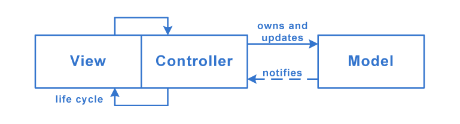

# [Apple MVC](https://medium.com/ios-os-x-development/ios-architecture-patterns-ecba4c38de52#6115)
- **Model** — responsible for the domain data or a data access layer which manipulates the data.
- **ViewController** — responsible for everything else.

## Structure

