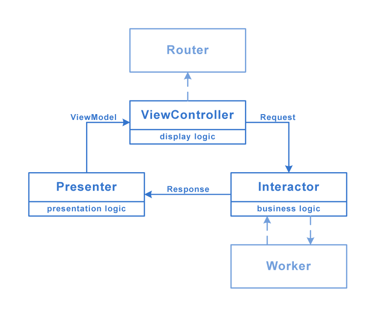

# Clean Swift
- The **ViewController** is responsible for the display logic.
- The **Interactor** is responsible for the business logic.
- The **Presenter** is responsible for the presentation logic.
- The **Router** class contains all the navigation options where that specific **ViewController** can navigate trough.
- A **Worker** is a helper of the **Interactor**, which can help receiving data.

## Structure
