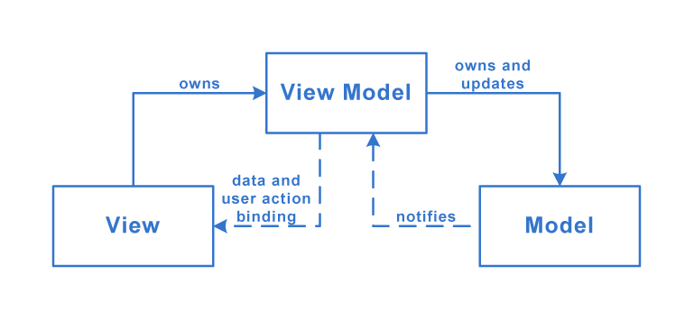

# [MVVM](https://medium.com/ios-os-x-development/ios-architecture-patterns-ecba4c38de52#61be)
- **Model** — responsible for the domain data or a data access layer which manipulates the data.
- **View** — responsible for the presentation layer (GUI), for iOS environment think of everything starting with 'UI' prefix.
- **ViewModel** — the glue or the mediator between the **Model** and the **View**, in general responsible for altering the **Model** by reacting to the user's actions performed on the **View** and updating the **View** with changes from the **Model**.

## Structure

