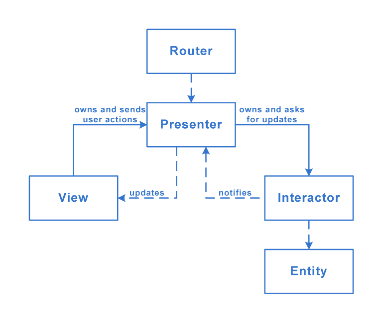

# VIPER
- **Interactor** — contains business logic related to the data (**Entities**) or networking, like creating new instances of entities or fetching them from the server. For those purposes you'll use some Services and Managers which are not considered as a part of VIPER module but rather an external dependency.
- **View** — responsible for the presentation layer (GUI), for iOS environment think of everything starting with 'UI' prefix.
- **Presenter** — contains the UI related (but UIKit independent) business logic, invokes methods on the **Interactor**.
- **Entities** — your plain data objects, not the data access layer, because that is a responsibility of the **Interactor**.
- **Router** — responsible for the segues between the VIPER modules.

## Structure

